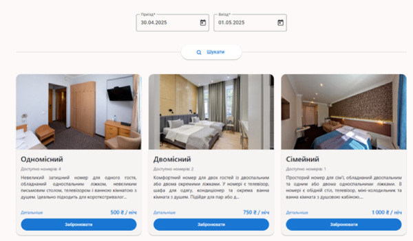
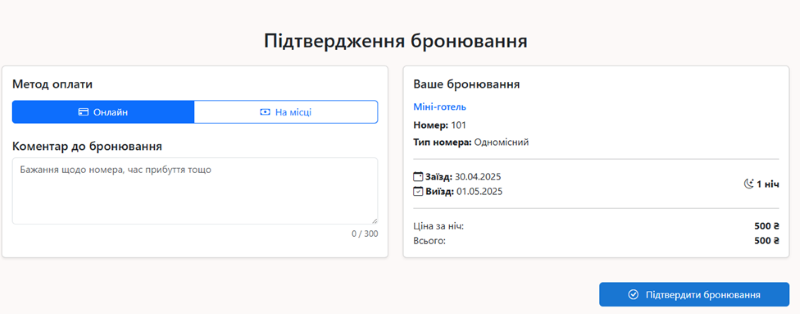
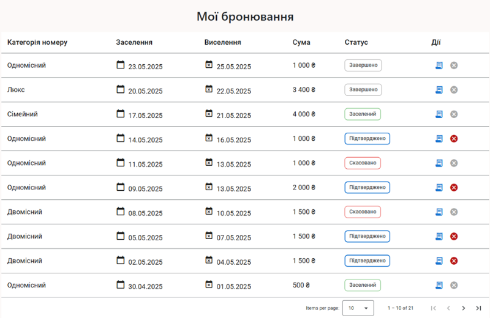
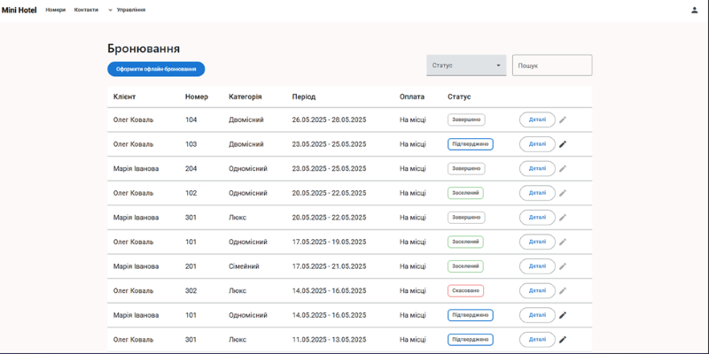
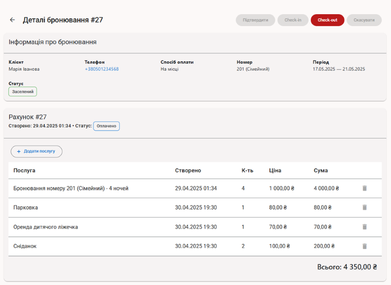

# 🏨 MiniHotel – Web Application for Small-Hotel Automation

**MiniHotel** is a full-stack web app that streamlines the everyday workflows of a small hotel—room search and booking, service management, invoicing, and secure online payments.

---

## 🌐 Live demo

**Railway:** <https://minihotel-production.up.railway.app/>

| Role         | Email                       | Password     |
| ------------ | --------------------------- | ------------ |
| Manager      | `manager@hotel.com`         | `Password1!` |
| Receptionist | `receptionist@hotel.com`    | `Password1!` |
| Client       | `maria.ivanova@example.com` | `Password1!` |

---

## 📌 Key features

### For guests

- Search available rooms by date range
- View room-type cards with photos, descriptions, and prices
- Book rooms online in a single click
- Pay safely via **LiqPay**
- View or cancel current bookings
- Review final invoices, including any extra services

### For staff (receptionists & managers)

- Full CRUD for room types, rooms, and extra services
- View and edit bookings (dates, room)
- Add services during a guest’s stay
- Inspect invoice and payment history for every booking

---

## 🧰 Tech stack

| Layer        | Technology                                                                        |
| ------------ | --------------------------------------------------------------------------------- |
| **Frontend** | Angular 17 · Angular Material · RxJS · ngx-toastr                                 |
| **Backend**  | ASP.NET Core 8 (Web API) · EF Core + PostgreSQL · Clean Architecture · AutoMapper |
| **Auth**     | ASP.NET Core Identity + JWT (`Client`, `Receptionist`, `Manager`)                 |
| **Dev Ops**  | Docker / Docker Compose · Railway · GitHub Actions (CI)                           |

---

## 📷 Screenshots

### 🔍 Search & booking


### Confirm booking


### User bookings view


### 🛠 Room-type management


### 💳 Bookings admin view


### Booking details admin view


## 🚀 Quick start

### Run everything with Docker

```bash
git clone https://github.com/Vlad-Bilyk/MiniHotel.git
cd MiniHotel
docker-compose up --build -d        # spins up db + API + Angular SPA
```
